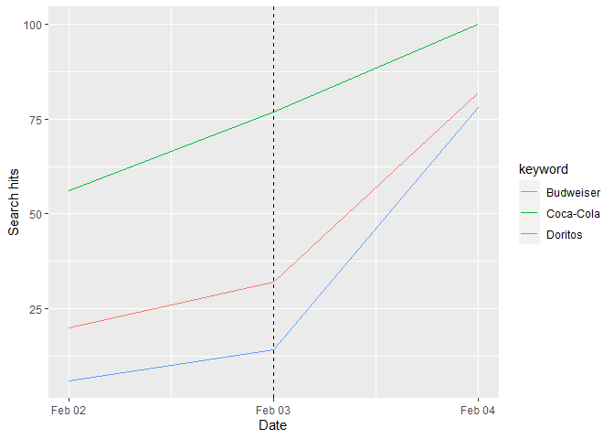
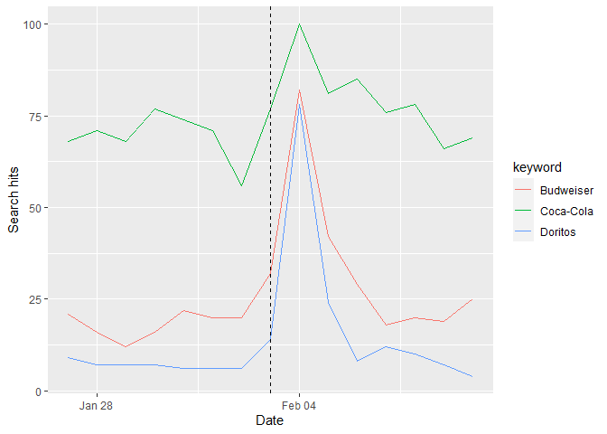

README !
================

# Super-Bowl-Ads

# Usage and examples of project_utils package

import the datasets:

``` r
data <- get_data() # the main dataset, contains ads info
rating <- get_rating_data() # contains rating info, e.g., ads cost, viewrs and etc
general <- get_general_data() # ads categories, e.g., beer, car and etc 
```

- <code>search_dates</code>

  returns the dates where a brand had ads on the Superbowl

``` r
brand <- "Coca-Cola"
dates <- search_dates(brand)
head(dates)
```

    ##         date
    ## 1 2007-02-04
    ## 2 2008-02-03
    ## 3 2009-02-01
    ## 4 2011-02-06
    ## 5 2012-02-05
    ## 6 2014-02-02

- <code>search_brands</code>

  returns the brands that had a Superbowl ad on the desired year

``` r
brands <- search_brands(2015)
brands
```

    ## # A tibble: 6 × 2
    ##   brand     count
    ##   <chr>     <int>
    ## 1 Budweiser     3
    ## 2 Coca-Cola     1
    ## 3 Doritos       3
    ## 4 Kia           1
    ## 5 Pepsi         1
    ## 6 Toyota        1

- gtopics(brands, time)

  Works just like <code>gtrends</code> (from gtrendsR library) but shows
  the results for the brand’s topic

  ``` r
  head(gtopics("Doritos","all")$interest_over_time)
  ```

      ##         date hits keyword geo time gprop category
      ## 1 2004-01-01    9 Doritos  US  all   web        0
      ## 2 2004-02-01    8 Doritos  US  all   web        0
      ## 3 2004-03-01    7 Doritos  US  all   web        0
      ## 4 2004-04-01    4 Doritos  US  all   web        0
      ## 5 2004-05-01    8 Doritos  US  all   web        0
      ## 6 2004-06-01    7 Doritos  US  all   web        0

- <code>gtopics_plot(brands, date, rday=1)</code>

  Will display the google trends plot, where rday is the “radius” of
  days before and after the ad the you with to observe so following the
  examples above:

``` r
gtopics_plot(brands=brand, date=dates[2,], rday=1)
```

<!-- -->

``` r
gtopics_plot(brands=brand, date=dates[2,], rday=3)
```

<!-- -->

\*The dashed line marks the Superbowl date

If we want to compare several brands together we can use gtrend_plot as
follows:

``` r
brands_to_compare <- brands[1:3,]$brand # taking 3 companies from the exmaple above (Budweiser, Coca-Cola, Doritos)
gtopics_plot(brands=brands_to_compare, date=dates[2,], rday=1)
```

<!-- -->

``` r
gtopics_plot(brands=brands_to_compare, date=dates[2,], rday=7)
```

<!-- -->

- <code>gtopics_r(brands, date, rday=1)</code>

  Returns the “RAW” tabular data of gtrends (while converting the brand
  name to the relevant topic)

``` r
gtopics_r(brands=brands_to_compare, date=dates[2,], rday=1)
```

    ## $interest_over_time
    ##         date hits   keyword geo                  time gprop category
    ## 1 2008-02-02   56 Coca-Cola  US 2008-02-02 2008-02-04   web        0
    ## 2 2008-02-03   77 Coca-Cola  US 2008-02-02 2008-02-04   web        0
    ## 3 2008-02-04  100 Coca-Cola  US 2008-02-02 2008-02-04   web        0
    ## 4 2008-02-02   20 Budweiser  US 2008-02-02 2008-02-04   web        0
    ## 5 2008-02-03   32 Budweiser  US 2008-02-02 2008-02-04   web        0
    ## 6 2008-02-04   82 Budweiser  US 2008-02-02 2008-02-04   web        0
    ## 7 2008-02-02    6   Doritos  US 2008-02-02 2008-02-04   web        0
    ## 8 2008-02-03   14   Doritos  US 2008-02-02 2008-02-04   web        0
    ## 9 2008-02-04   78   Doritos  US 2008-02-02 2008-02-04   web        0
    ## 
    ## attr(,"class")
    ## [1] "gtrends" "list"
