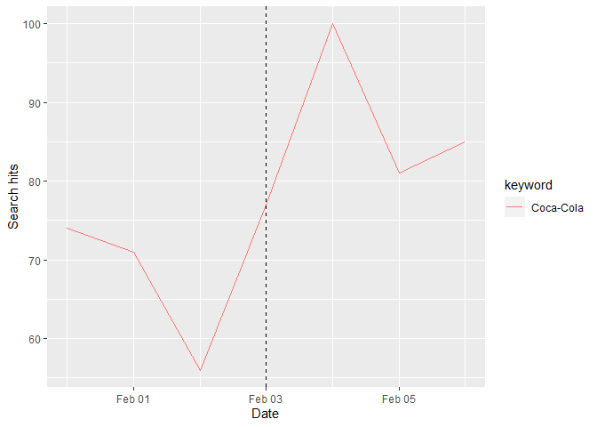

README !
================

# Super-Bowl-Ads

# Usage and examples of project_utils package

import the datasets:

``` r
fmt <- "%Y-%m-%d" 

data <- get_data() # the main dataset, contains ads info
rating <- get_rating_data() # contains rating info, e.g., ads cost, viewrs and etc
general <- get_general_data() # ads categories, e.g., beer, car and etc 
```

- <code>search_dates</code>

  returns the dates where a brand had ads on the Superbowl

``` r
brand <-  "Coca-Cola"
dates <-  search_dates(brand)
dates[2,]
```

    ## [1] "2005-02-06"

- <code>search_brands</code>

  returns the brands that had a Superbowl ad on the desired year

``` r
brands <- search_brands(2015)
brands
```

    ## # A tibble: 6 × 2
    ##   brand     count
    ##   <chr>     <int>
    ## 1 Budweiser     3
    ## 2 Coca-Cola     1
    ## 3 Doritos       3
    ## 4 Kia           1
    ## 5 Pepsi         1
    ## 6 Toyota        1

- <code>gtrands_plot</code>

  Will display the google trands plot, where rday is the “radius” of
  days before and after the ad the you with to observe so following the
  examples above:

``` r
gtrends_plot(brands=brand, date=dates[2,], rday=1)
```

<!-- -->

``` r
gtrends_plot(brands=brand, date=dates[2,], rday=3)
```

<!-- -->

\*The dashed line marks the Superbowl date

If we want to compare several brands together we can use gtrend_plot as
follows:

``` r
brands_to_compare <- brands[1:3,]$brand # taking 3 companies from the exmaple above (Budweiser, Coca-Cola, Doritos)
gtrends_plot(brands=brands_to_compare, date=dates[2,], rday=1)
```

<!-- -->

``` r
gtrends_plot(brands=brands_to_compare, date=dates[2,], rday=7)
```

<!-- -->
